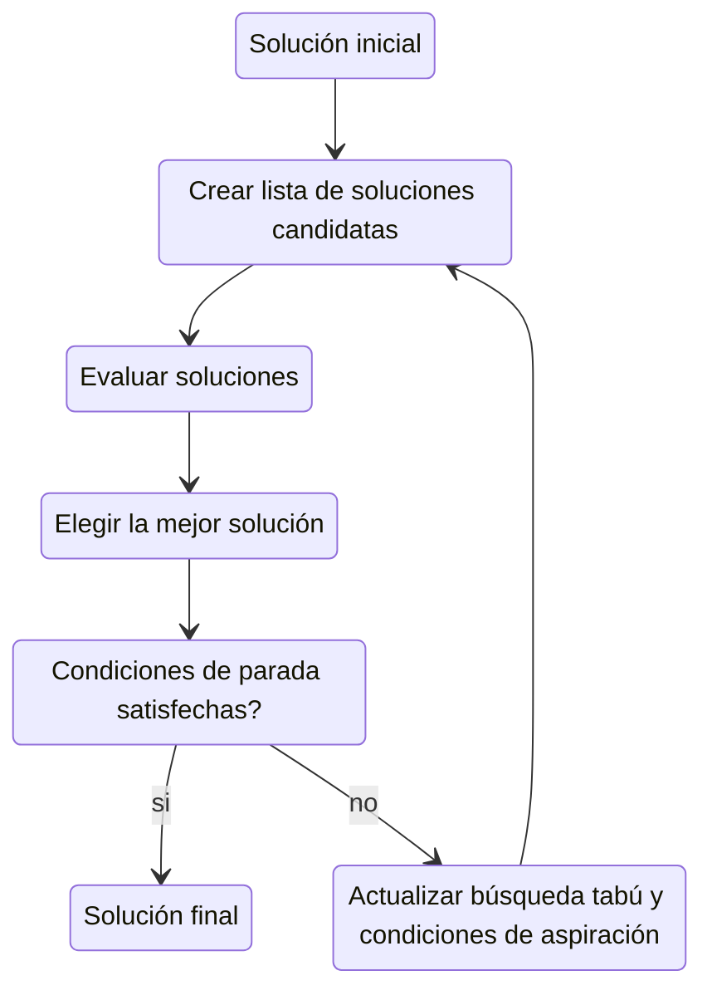

# jobshop

Metaheurísticas aplicadas al Job-Shop Scheduling Problem (JSSP)

## Enunciado del problema

En  una fábrica  se tienen  _n_ trabajos  y _m_  máquinas. Dónde  cada
trabajo consiste de  _m_ operaciones, las cuales  deben ser procesadas
en  la máquina  que  les  corresponde durante  cierto  tiempo. Da  una
planificación en la  que las operaciones se  encuentren organizadas de
modo que se  procesen en el menor tiempo posible  y menciona el tiempo
que  transcurre desde  el inicio  de la  planificación hasta  que esta
termina, este valor también es conocido como *makespan*.

### Entrada del problema

La  primera línea  de cada  instancia[<sup>1</sup>](#fn1) contiene  el
número de trabajos seguido de el número  de máquinas en el shop: _n_ y
_m_ respectivamente,  con _n_  y _m_ finitos.   En las  siguientes _n_
líneas hay _m_ operaciones que corresponden a parejas con el número de
máquina y el tiempo de procesamiento de dicha operación.

*Observación*: Las  máquinas se encuentra numeradas  comenzando por el
0.

*Restricciones*

- Ninguna tarea de un trabajo  puede empezar hasta que la tarea previa
  de dicho trabajo se complete.
- Una máquina solo puede trabajar en una tarea a la vez.
- Una vez iniciada una tarea, debe correr hasta completarse.

### Resultado esperado

Solución  factible  que ilustre  la  relación  de precedencia  de  las
máquinas.

## Preproceso de una instancia


Antes de aplicar  cualquier metaheurística es necesario  llevar a cabo
un **preproceso** de las instancias.

### Lectura de ejemplares

La **lectura  de los ejemplares** puede  variar entre implementaciones
de distintos lenguajes, en este caso  con *c++* se realiza mediante la
biblioteca ```fstream```. 

### Esquema de representación 

En  cuanto al  esquema de  **representación**,  a la  fecha existen  9
maneras[<sup>2</sup>](#fn2) de representar el problema, decidimos usar
la de la *gráfica disyuntiva*[<sup>3</sup>](#fn3) porque representa el
problema  de   forma  natural  visualmente,  además   de  que  permite
considerar vecindades en  las cuáles se garantice que  los vecinos son
soluciones factibles.

Generalmente estas  vecindades se encuentran  basadas en la  noción de
*operación  crítica*.  Consideramos  que una  operación es  crítica si
pertenece a  alguna *ruta  crítica*, que  se define  como la  ruta más
larga desde la operación ficticia $0$ (operación que marca el comienzo
de todas las operaciones) hasta la opearción ficticia $N+1$ (operación
que marca el fin de todas las operaciones).

Se sabe  que una  operación es  crítica si  y sólo  sí se  cumple que:
$`r_{i} + q_{i} = C_{max}`$, donde:

-  $`r_{i}`$ es  la ruta  más larga  desde la  operación $0$  hasta la
  operación $i$ (sin  contarla); representa el tiempo  más temprano en
  el que puede iniciar la operación $i$ (considerando que para que una
  operación pueda iniciar, sus predecesores en el job, y en la máquina
  correspondiente, ya deben haber finalizado).

- $`q_{i}`$ es la ruta más larga desde la operación $i$ (incluyéndola)
  hasta la operación $N+1$; representa  el tiempo del trabajo que esta
  pendiente por realizarse (a partir de la operación $i$).

### Evaluación de vecindades

De  manera general  podemos considerar  dos tipos  de **evaluación  de
vecindades**:

- *Evaluación  Exacta*.  En  este tipo de  evaluación se  recalcula el
makespan para cada vecino; considerando que calcular el makespan tiene
una complejidad  de $`O(N)`$, y  que en general las  vecindades suelen
tener  en promedio  $`O(N)`$ vecinos,  evaluar una  vecindad con  esta
estrategia suele tener una complejidad de $`O(N^{2})`$.

-  *Evaluación  Estimada*.  Dependiendo  del tipo  de vecindad  que se
tenga, se  pueden considerar diferentes criterios  para poder realizar
una estimación del makespan de  los vecinos.  Calcular esta estimación
suele  tener  una  complejidad  constante,  por  lo  que  evaluar  una
vecindad, con esta estrategia, se suele hacer en $`O(N)`$.

### Búsqueda local

#### Vecindad

En  el  artículo  de  Taillard[<sup>3</sup>](#fn3)  se  considera  una
**solución vecina** como la  propuesta de intercambiar dos operaciones
críticas consecutivas (en la misma máquina).

Propiedades de la *solución vecina*:

- Comenzando con  una solución factible, la nueva  solución también es
  factible.

-  Comenzando  con una  solución  factible,  es posible  alcanzar  una
  solución optima.

El siguiente es el pseudocódigo para calcular la lista de vecinos:

```
calcular_vecinos():
  para cada i:
    - considera los pares de operaciones que surgen en las rutas críticas
    para cada j en la iésima máquina:
      si j es una operación crítica i.e. j.r + j.q == makespan y j+1 es una operación crítica
        entonces -> se agrega el par (j, j+1) a la lista de vecinos
```

Si intercambiamos las operaciones críticas $`a`$ y $`b = SM_{a})`$, los
valores de los nuevos parámetros pueden ser calculados del siguiente modo:

- $`d_{i} = max(r_{PM_{a}} + d_{PM_{a}}, r_{PJ_{b}} + d_{PJ_{b}})`$

- $`r'_{a} = max(r'_{b} + d_{b}, r_{PJ_{a}} + d_{PJ_{a}})`$

- $`q'_{a} = max(q_{SM_{b}}, q_{SJ_{a}}) + d_{a}`$

- $`q'_{b} = max(q'_{a}, q_{SJ_{b}}) + d_{b}`$

donde $`C'_{max} = max(r'_{b} + q'_{b}, r'_{a} + q'_{a})`$

#### Algoritmo de búsqueda

El algoritmo de búsqueda local es  la base de muchos métodos usados en
problemas de optimización, se puede  ver como un proceso iterativo que
empieza  en  una  solución   y  la  mejora  realizando  modificaciones
locales. Básicamente  empieza con una  solución inicial y busca  en su
vecindad una  mejor solución. Si  la encuentra, reemplaza  su solución
actual por la nueva  y continúa con el proceso, hasta  que no se pueda
mejorar la solución actual.

```
búsqueda_local():
  s = genera una solución inicial
  mientras s no sea un óptimo local:
    s' en N(s) con f(s) < f(s') (mejor solución dentro de la vecindad de s)
    s <- s'
  regresa s
```

La  búsqueda local  tiene la  **ventaja** de  encontrar soluciones  de
forma muy  rápida, eso  si, su principal  **desventaja** es  que queda
atrapada fácilmente  en mínimos  locales y  su solución  final depende
fuertemente de la solución inicial.

## Aplicación de una metaheurísticas de trayectoria

Una  vez  realizado  el  preproceso podemos  pasar  a  aplicar  alguna
metaheurística, en este caso hemos optado por la búsqueda tabú, ya que
resulta  muy  eficiente  para  encontrar soluciones  óptimas  en  poco
tiempo.

### Búsqueda Tabú



<!-- explicación del diagrama y algunos otros términos -->
<!-- pseudocódigo -->

## Uso

Compilación del programa
```
make compile
```

Ejecución del programa
```
make run
```

## Referencias

<a  name="fn1">1</a>:   Todas  las   instancias  fueron   tomadas  del
repositorio                            de                           <a
href="https://github.com/tamy0612/JSPLIB/tree/master/instances">Yasumasa
Tamura</a>

<a  name="fn2">2</a>:  R.  Cheng,  M.  Gen,  Y.  Tsujimura.  1996.  <a
href="https://www.sciencedirect.com/science/article/abs/pii/0360835296000472">A
Tutorial  Survey   of  Job-Shop  Scheduling  Problems   Using  Genetic
Algorithms-I</a>.  Representation.  Elsevier Science Ltd.

<a    name="fn2">3</a>:     Eric    D.     Taillard.      1994.     <a
href="https://pubsonline.informs.org/doi/epdf/10.1287/ijoc.6.2.108">Parallel
Taboo Search Techniques for the Job Shop Scheduling Problem</a>.  ORSA
Journal on Computing.

<sup>
Todo el código se encuentra bajo la <a href="LICENSE">licencia GPL-3.0</a>.
</sup>
